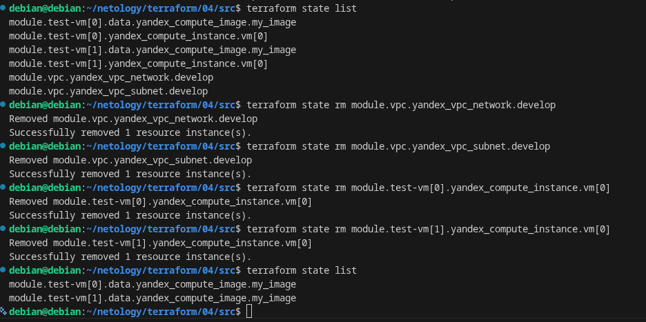
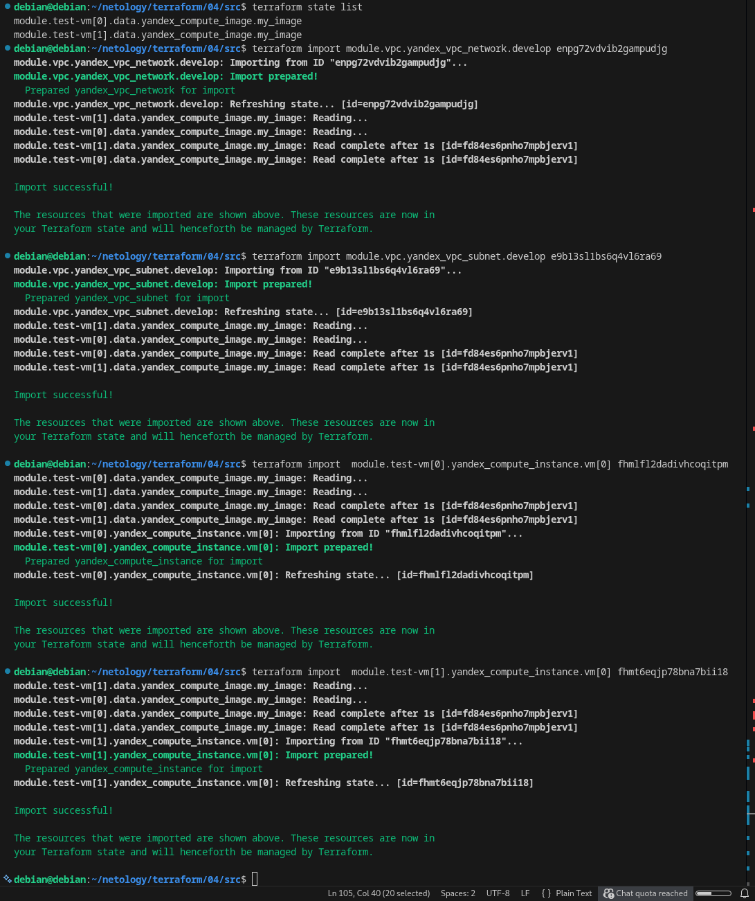
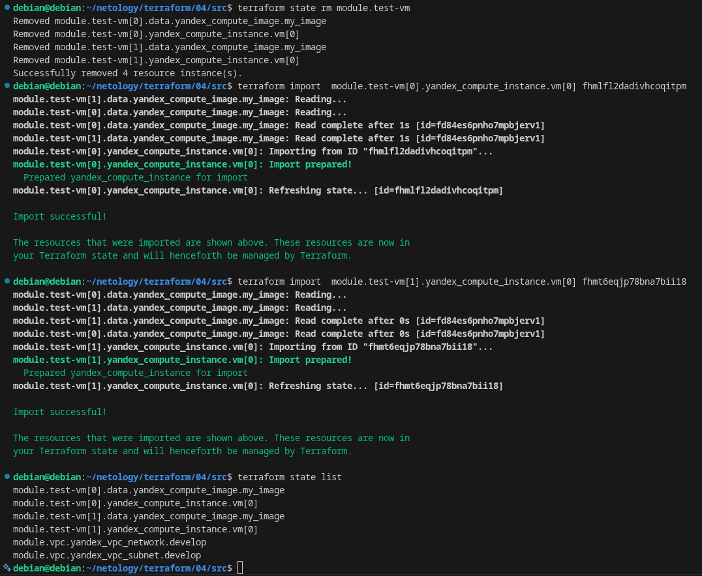
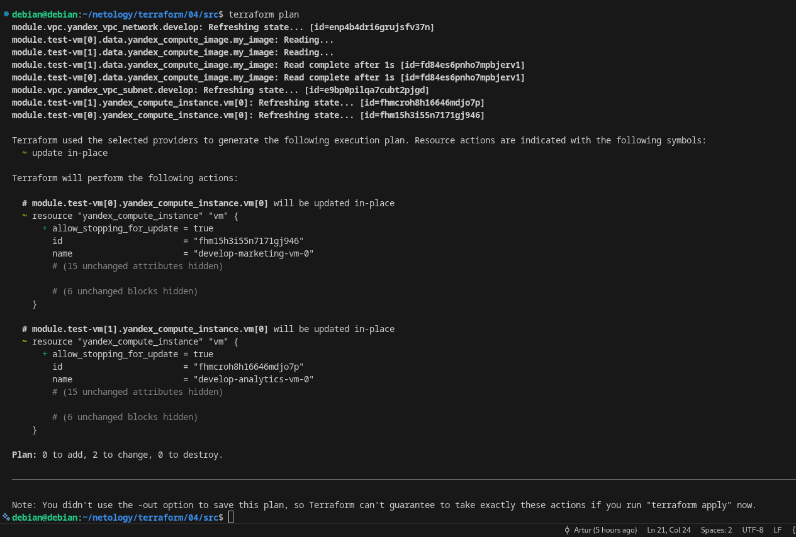

# ter-homeworks-04
##Задание 1
  
> Вывод команды sudo nginx -t  
  

  

  
> Результат из консоли для первого модуля(module.test-vm[0]), результат на двух скринах, так как просто не умещалось в один.
  

  

  

  
##Задание 2
  
> Если запускать модуль отдельно, то получается следующее:  
  

  

  

  
> Если запускать весь проект, тогда будет:  
  

  

  
> Результат применения terraform-docs к созданному модулю:  
  
[Terraform-docs](https://github.com/ufilin/ter-homeworks-04/blob/main/vpc/module_vpc.md "Посмотреть рузельтат")
  
##Задание 3  
  
>Удаляем все модули  
   

  

  
> Восстанавливаем модули  
  

  

  
> Удаление можно сделать более короткой командой  
  

  

  
> Результат комманды terraform plan, без значимых изменений, только рекомендация добавить строчку в конфиге.  
  

  

 
