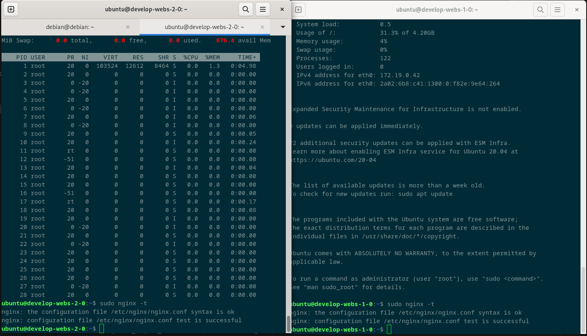
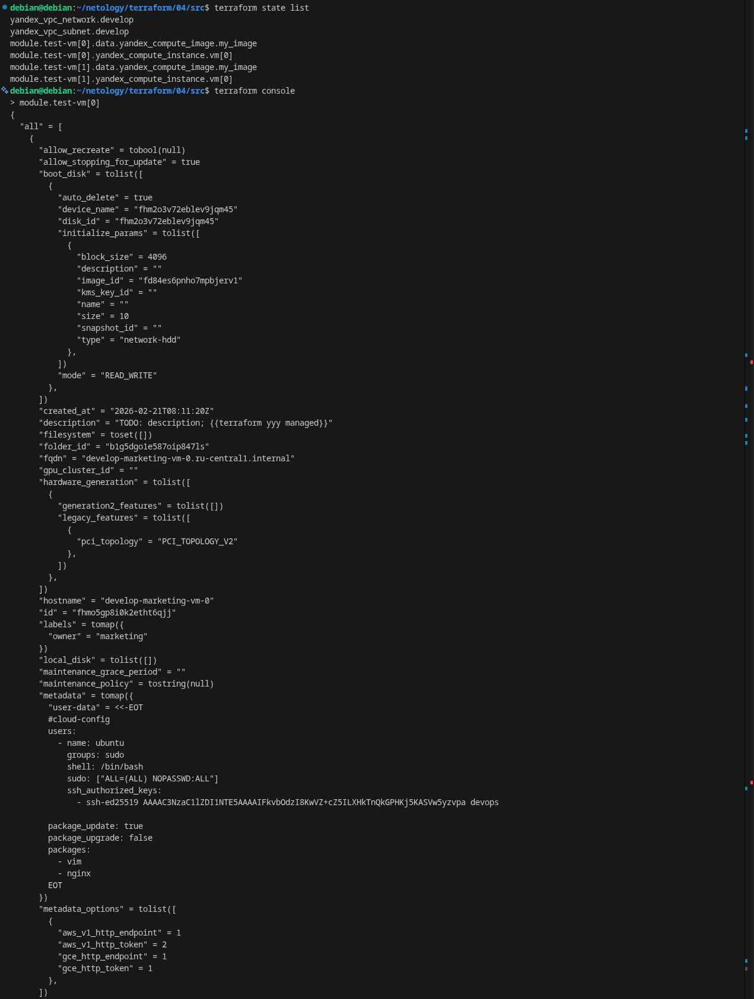
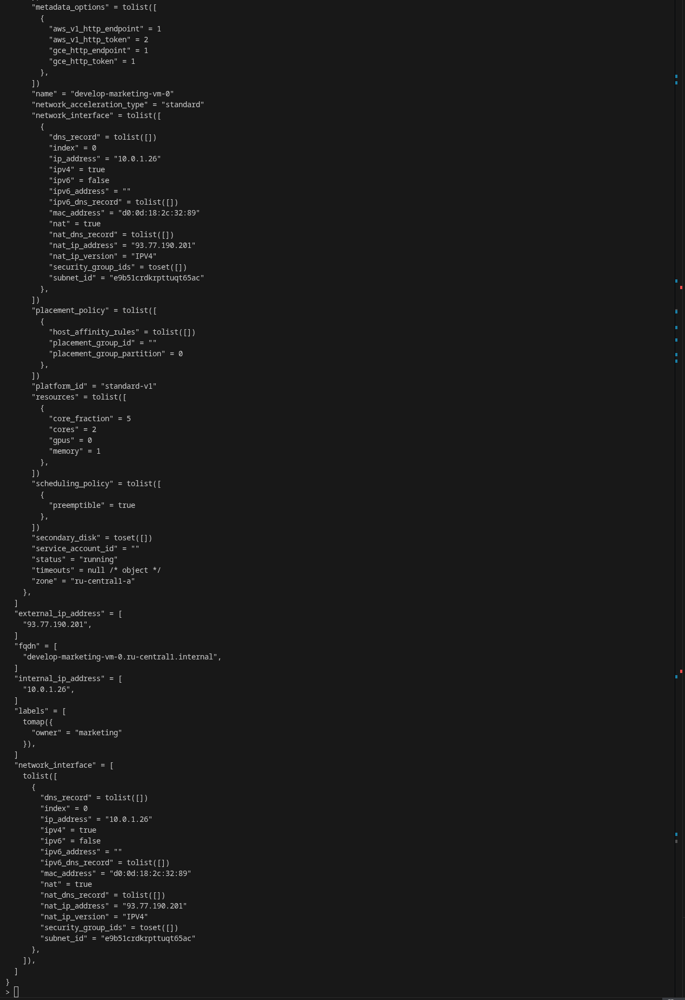
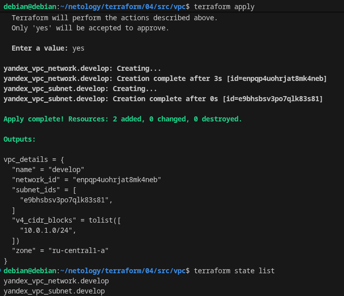
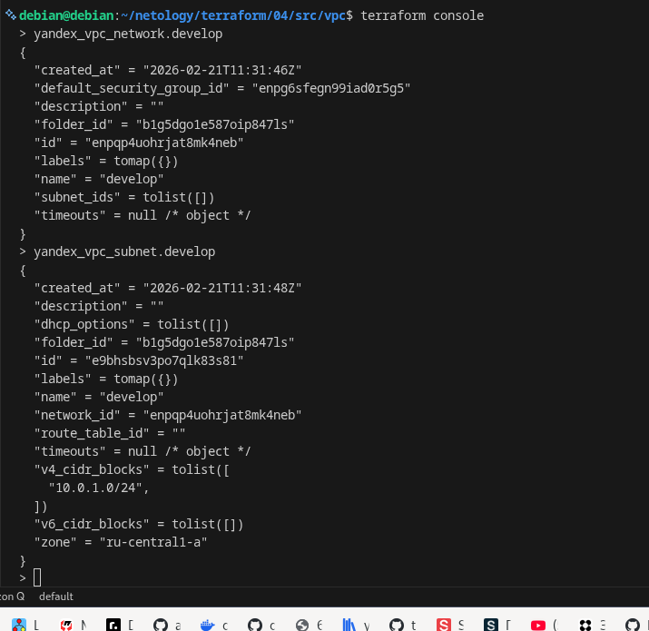
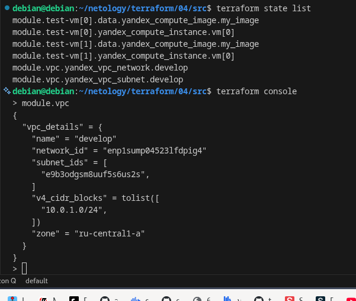

# ter-homeworks-04
##Задание 1
  
> Вывод команды sudo nginx -t  
  

  

  
> Результат из консоли для первого модуля(module.test-vm[0]), результат на двух скринах, так как просто не умещалось в один.
  

  

  

  
##Задание 2
  
> Если запускать модуль отдельно, то получается следующее:  
  

  

  

  
> Если запускать весь проект, тогда будет:  
  

  

  
##Задание 3
  
>
  
